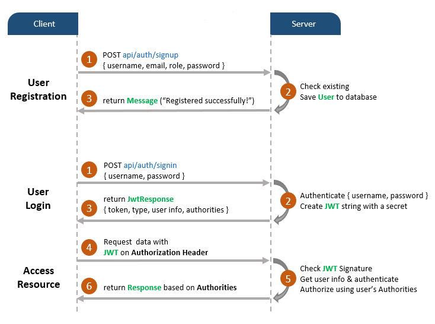
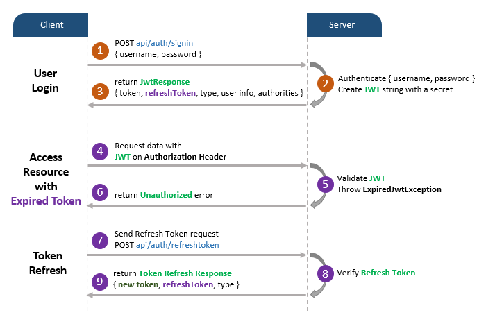
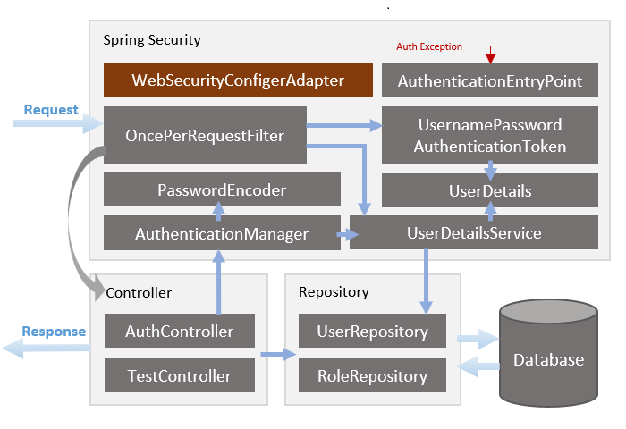

# Spring Boot Refresh Token with JWT example

Build JWT Refresh Token in the Java Spring Boot Application. You can know how to expire the JWT, then renew the Access Token with Refresh Token.

The instruction can be found at:
[Spring Boot Refresh Token with JWT example](https://github.com/phamquocngu/java-springboot/edit/master/refresh-token-jwt/)

## User Registration, User Login and Authorization process.
The diagram shows flow of how we implement User Registration, User Login and Authorization process.



And this is for Refresh Token:



## Spring Boot Server Architecture with Spring Security
You can have an overview of our Spring Boot Server with the diagram below:


## Using liquidbase management change log database
## Using OpenAPI to document for project
## Dependency
```xml
<dependencies>
	<dependency>
		<groupId>org.springframework.boot</groupId>
		<artifactId>spring-boot-starter-data-jpa</artifactId>
	</dependency>
	<dependency>
		<groupId>org.springframework.boot</groupId>
		<artifactId>spring-boot-starter-security</artifactId>
	</dependency>
	<dependency>
		<groupId>org.springframework.boot</groupId>
		<artifactId>spring-boot-starter-web</artifactId>
	</dependency>
	<dependency>
		<groupId>org.springframework.boot</groupId>
		<artifactId>spring-boot-starter-validation</artifactId>
	</dependency>
	<dependency>
		<groupId>mysql</groupId>
		<artifactId>mysql-connector-java</artifactId>
		<scope>runtime</scope>
	</dependency>
	<dependency>
		<groupId>io.jsonwebtoken</groupId>
		<artifactId>jjwt</artifactId>
		<version>0.9.1</version>
	</dependency>
	<dependency>
		<groupId>javax.validation</groupId>
		<artifactId>validation-api</artifactId>
		<version>2.0.1.Final</version>
	</dependency>
	<!-- liquibase-core -->
	<dependency>
		<groupId>org.liquibase</groupId>
		<artifactId>liquibase-core</artifactId>
	</dependency>
	<!-- SpringDoc -->
	<dependency>
		<groupId>org.springdoc</groupId>
		<artifactId>springdoc-openapi-ui</artifactId>
		<version>${springdoc.version}</version>
	</dependency>
	<dependency>
		<groupId>org.springdoc</groupId>
		<artifactId>springdoc-openapi-data-rest</artifactId>
		<version>${springdoc.version}</version>
	</dependency>
	<dependency>
		<groupId>org.springframework.boot</groupId>
		<artifactId>spring-boot-starter-test</artifactId>
		<scope>test</scope>
	</dependency>
	<dependency>
		<groupId>org.springframework.security</groupId>
		<artifactId>spring-security-test</artifactId>
		<scope>test</scope>
	</dependency>
	<dependency>
		<groupId>junit</groupId>
		<artifactId>junit</artifactId>
		<version>4.13.1</version>
		<scope>test</scope>
	</dependency>

</dependencies>
```
## Configure Spring Datasource, JPA, App properties
Open `src/main/resources/application.yml`

```yml
server:
  port: 8005
####Spring configuration####
spring:
  banner:
    location: classpath:banner.txt
  application:
    name: user-service
  datasource:
    url: jdbc:mysql://localhost:3306/testdb?serverTimezone=UTC&allowPublicKeyRetrieval=true&useSSL=false&characterEncoding=UTF-8
    username: root
    password: 123456
    driver-class-name: com.mysql.cj.jdbc.Driver
    initialization-mode: always
    hikari:
      connectionTimeout: 30000
      idleTimeout: 600000
      maxLifetime: 1800000
      minimum-idle: 5
      maximum-pool-size: 5
  jpa:
    hibernate:
      naming:
        physical-strategy: org.hibernate.boot.model.naming.PhysicalNamingStrategyStandardImpl
      ddl-auto: update
    properties:
      hibernate:
        show_sql: false
        format_sql: true 
  jackson:
    serialization:
      fail-on-empty-beans: false
##Liquibase configuration##
  liquibase:
    change-log: classpath:/db/changelog/changelog-master.xml
####App properties####
app:
  jwt:
    secretKey: markloveSecretKey
    #expirationMs= 3600000
    #refreshExpirationMs= 86400000
    ##For test
    expirationMs: 600000
    refreshExpirationMs: 1200000
  signup:
    defaultRoles:
      - ROLE_USER
    expirationHours: 24
  reset-password:
    expirationHours: 24
###### Spring doc ######
springdoc:
  version: @springdoc.version@
  # custom path for swagger-ui
  swagger-ui:
    path: swagger-ui.html
    operationsSorter: method
  # custom path for api docs
  api-docs:
    path: api-docs
```

## Run Spring Boot application
```
mvn spring-boot:run
```
## Init database
``` Role
INSERT INTO roles(name) VALUES('ROLE_USER');
INSERT INTO roles(name) VALUES('ROLE_MODERATOR');
INSERT INTO roles(name) VALUES('ROLE_ADMIN');
``
``` User
@Override
public void run(String... args) throws Exception {
	if(!userRepository.existsByUsername("ngupq")) {
		User user = new User();
		user.setUsername("ngupq");
		user.setEmail("ngupq@gmail.com");
		user.setPassword(passwordEncoder.encode("123456"));
		user.setEnable(true);
		user.setAccountExpired(false);
		user.setAccountLocked(false);
		user.setCredentialsExpired(false);
		Set<Role> roles = new HashSet<>();
		roles.add(roleRepository.findByName(ERole.ROLE_ADMIN).orElseGet(null));
		roles.add(roleRepository.findByName(ERole.ROLE_USER).orElseGet(null));
		roles.add(roleRepository.findByName(ERole.ROLE_MODERATOR).orElseGet(null));
		user.setRoles(roles);
		userRepository.save(user);
		System.out.println(user);
	}
}
```
